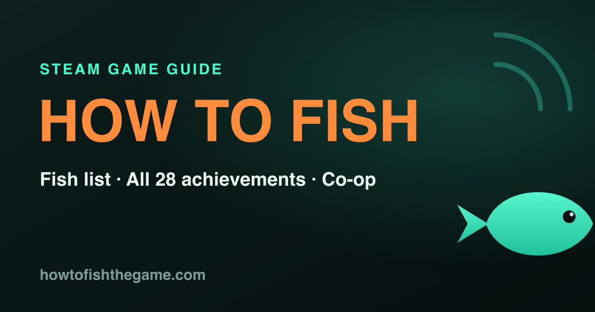
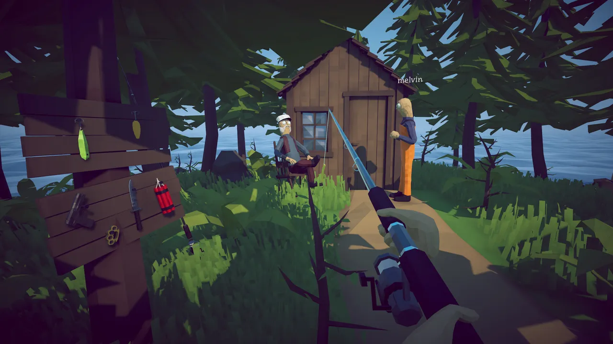
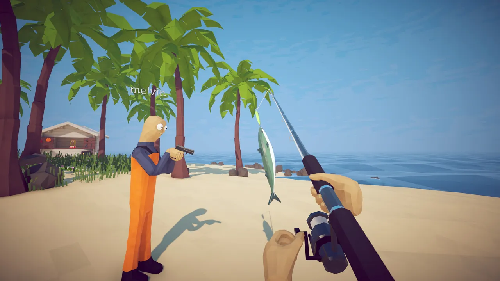

<div align="center">



# How to Fish Hub

**The player guide for the Steam game [How to Fish](https://store.steampowered.com/app/4001890/) by Dazed Games.**

Fish list, all 28 achievements, co-op setup, controls, boss strategies and quick answers.
An independent, fan-made resource. Fast answers, real game data, no fluff.

[**Live site → howtofishthegame.com**](https://howtofishthegame.com)


</div>

---

## About the game

Despite the name, How to Fish is not a fishing sim. It is a physics first-person game where you
catch creatures, kill them with weapons, and sell them for money to upgrade your gear, fight bosses,
and progress across islands. Released Aug 20 2026, $7.99, Overwhelmingly Positive (95% of 16,000+ reviews).

## What the site covers

| Page | What it does |
| --- | --- |
| **Fish List** | All 49 creatures grouped by bait/lure tier, with an interactive "caught" tracker (saved in your browser) |
| **Bosses** | Island bosses, the bait that lures them, and how to beat each one |
| **Achievements** | All 28 Steam achievements with exact steps and global unlock rates |
| **Co-op** | How to invite friends, player count, crossplay status, and lobby fixes |
| **Controls** | Keybinds, how to sell fish, and controller support |
| **Beginner Guide** | Core loop, money tips, and which upgrades to buy first |
| **FAQ** | Console/crossplay/price answers with FAQ schema |
| **Patch Notes / Fixes** | Version tracking and troubleshooting (Steam Error 51, low FPS, crashes) |

## Screenshots

<div align="center">




<sub>In-game screenshots © Dazed Games, via Steam.</sub>

</div>

## Tech stack

- **Next.js 16** with `output: export` (fully static, no server)
- **Tailwind CSS v4**
- **TypeScript**
- Deployed as static assets on **Cloudflare Pages**
- Structured data (VideoGame, Organization, FAQ), sitemap, IndexNow, GA4

## Project structure

```
src/
  app/            # routes (one folder per page) + layout, sitemap, robots, manifest
  components/     # UI, screenshots, trailer, collection tracker, ads
  data/           # game.ts (creatures, achievements, bosses), media.ts
  lib/            # site config + metadata helper
public/
  game/           # optimized screenshots + trailer thumbnail (webp)
scripts/
  indexnow.mjs    # submit sitemap URLs to IndexNow
```

## Develop

```bash
npm install
npm run dev      # http://localhost:3000
npm run build    # static export to ./out
```

## Deploy (Cloudflare Pages, Git integration)

Connect this repo in the Cloudflare dashboard (Workers & Pages, Create, Pages, Connect to Git):

| Setting | Value |
| --- | --- |
| Framework preset | Next.js (Static HTML Export) |
| Build command | `npm run build` |
| Build output directory | `out` |
| Environment variable | `NODE_VERSION` = `20` |

Then add the custom domain `howtofishthegame.com` in the Pages project. Pushes to `main` auto-deploy.

## SEO

- `scripts/indexnow.mjs` submits every sitemap URL to IndexNow (Bing, Yandex). Re-run after publishing pages.
- Google Search Console: verify via GA4 or DNS, then submit `sitemap.xml`.
- GA4 analytics is wired in the root layout.

## Editorial rules

- The head term "how to fish" is owned by literal fishing-tutorial sites, so the site targets only game-qualified long-tail queries.
- Unverified data (weapon prices, how-long-to-beat, per-fish values) is left out on purpose, never guessed. Anything unconfirmed is marked "check in-game."

## Disclaimer

Fan-made and not affiliated with Dazed Games, Valve, or Steam. All game names and assets belong to their
respective owners and are referenced for informational purposes.
